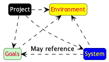

//------------------------------------
// SYSTEM book
//
// Template for requirement:
//---- Requirement
//[[sx-keyword]] 
//`{counter:sx}`
// Requirement

// {missing} [Corresponding Artifact]
//---- 
//------------------------------------
include::definitions.adoc[]

== System

=== S.1 Components

The components of the {companion} initially identified are the following:

- [[s1-overview]] `{counter:s1}` An overview of the {Method} method.
- [[s1-caseStudies]] `{counter:s1}` At least one case study ({Roborace})
- [[s1-bookTemplates]] `{counter:s1}` At least one book template

=== S.2 Functionality

{emptysec}

=== S.3 Interfaces

{emptysec}

=== S.4 Detailed usage scenarios

{emptysec}

=== S.5 Prioritization

{emptysec}

=== S.6 Verification and acceptance criteria

Here are some examples of verification rules currently implemented in the {companion}.

//---- Requirement
[[s6-mutualRefs]] 
`{counter:s6}`
The books may reference each other, but not arbitrarily. 
The <<mutualRefs,following diagram>> shows which books may refer to which. 

NOTE: It only governs the actual contents, ignoring the front and back matter.

[[mutualRefs]]
.Possible references between the books

{check} https://github.com/FormalRequirements/companionRequirements/blob/main/features/book.feature[Corresponding artifact]
//---- 
